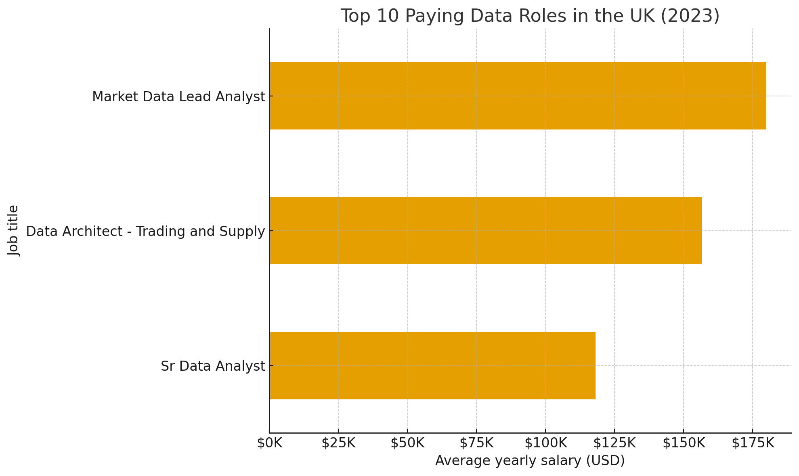
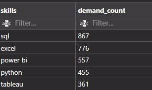
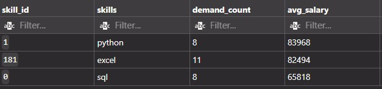

# Introduction

Dive into the data job market! Focusing on data analyst roles, this project explores top paying jobs, in- demand skills, and where high demand meets high salary in data analytics

SQL queries? check them out here: [Project_sql](/Project_sql/)

# Background

Driven by a quest to navigate the data analyst job market more effectively, this project was born from a desire to pinpoint top-paid and in-demand skills, streamlining others work to find optimal jobs.

## The questions I want to answer through my SQL queries are:

1. What are the top paying jobs for my role?
2. What are the skills required for these top-paying roles?
3. What are the most in-demand skills for my role?
4. What are thr top skills based on salary for my role
5. What are the most optimal skills to learn?
   optimal: High Demand and high paying.

# Tools I Used

For my deep dive into the data analyst job market,
I harnessed the power of several key tools:

- SQL: The backbone of my analysis, allowing me to query the database and uneart critical insights.

- PostgresSQL : The chosen database management system, ideal for handling the job posting data.

- Git & GitHub: Essential for version control and sharing my SQL scripts and analysis, ensuring collaboration and project tracting.

# The Analysis

Each query for this project aimed at investigating specific aspects of the data analyst job market.

Here's how I approaced each question:

### Top paying Data Analyst jobs

To identify the highest paying roles, I filtered data analyst positions by average yearly salary and location, focusing on United kingdom. This query highlights the high paying opportunity in the field.

```sql
SELECT
job_id,
job_title,
job_location,
job_schedule_type,
salary_year_avg,
job_posted_date,
name AS company_name

FROM job_postings_fact
LEFT JOIN company_dim ON job_postings_fact.company_id = company_dim.company_id

WHERE job_title_short = 'Data Analyst' AND
job_location = 'United Kingdom' AND
--( remove nulls).
salary_year_avg IS NOT NULL
ORDER BY salary_year_avg DESC
LIMIT 10

```

Here's the breakdown of the top data analyst jobs in 2023

- Highest salary: $180,000 – Market Data Lead Analyst (Deutsche Bank)
- Average salary: ≈ $108,000 / year
- Salary range: $75,000 – $180,000
- Half of roles pay $100k +

### What are the skills required for these top-paying roles?

```sql

WITH top_paying_jobs AS(
SELECT
job_id,
job_title,
salary_year_avg,
name AS company_name

FROM job_postings_fact
LEFT JOIN company_dim ON job_postings_fact.company_id = company_dim.company_id

WHERE job_title_short = 'Data Analyst' AND
job_location = 'United Kingdom' AND
--( remove nulls).
salary_year_avg IS NOT NULL
ORDER BY salary_year_avg DESC
LIMIT 10
)


SELECT top_paying_jobs.*,
skills
FROM top_paying_jobs
INNER JOIN  skills_job_dim ON top_paying_jobs.job_id = skills_job_dim.job_id
INNER JOIN skills_dim ON skills_job_dim.skill_id = skills_dim.skill_id

ORDER BY salary_year_avg DESC
LIMIT 10

```

## Result


_Top 3 top paying Data Analyst role in the United Kingdomin 2023_

## What are the most in-demand skills for Data Analyst?

```sql
SELECT
skills,
COUNT(skills_job_dim.job_id) AS demand_count

FROM job_postings_fact
INNER JOIN  skills_job_dim ON job_postings_fact.job_id = skills_job_dim.job_id
INNER JOIN skills_dim ON skills_job_dim.skill_id = skills_dim.skill_id
WHERE job_location = 'United Kingdom' AND job_title_short = 'Data Analyst'
GROUP BY skills
ORDER BY demand_count DESC

LIMIT 5

```

## Result



_Top demanded skills for data analyst in the Uk_

## Top Skills based on Salary for Data Analyst role

```sql

SELECT
skills,
ROUND(AVG(salary_year_avg),0) AS avg_salary
FROM job_postings_fact
INNER JOIN  skills_job_dim ON job_postings_fact.job_id = skills_job_dim.job_id
INNER JOIN skills_dim ON skills_job_dim.skill_id = skills_dim.skill_id
WHERE job_title_short = 'Data Analyst' AND salary_year_avg IS NOT NULL --AND job_location = 'United Kingdom'
GROUP BY skills
ORDER BY avg_salary DESC

LIMIT 10

```

## Result


_Top Skill based on average salary for Data Analyst salary roles_

## What are the most optimal skills to learn

```sql

WITH skills_demand AS (
SELECT
skills_dim.skill_id,
skills_dim.skills,
COUNT(skills_job_dim.job_id) AS demand_count
FROM job_postings_fact
INNER JOIN  skills_job_dim ON job_postings_fact.job_id = skills_job_dim.job_id
INNER JOIN skills_dim ON skills_job_dim.skill_id = skills_dim.skill_id

WHERE job_title_short = 'Data Analyst' AND
salary_year_avg IS NOT NULL
AND job_location = 'United Kingdom'
GROUP BY skills_dim.skill_id

),
average_salary AS (
SELECT
skills_job_dim.skill_id,
ROUND(AVG(salary_year_avg),0) AS avg_salary
FROM job_postings_fact
INNER JOIN  skills_job_dim ON job_postings_fact.job_id = skills_job_dim.job_id
INNER JOIN skills_dim ON skills_job_dim.skill_id = skills_dim.skill_id
WHERE job_title_short = 'Data Analyst' AND salary_year_avg IS NOT NULL AND job_location = 'United Kingdom'
GROUP BY skills_job_dim.skill_id

)

SELECT
skills_demand.skill_id,
skills_demand.skills,
demand_count,
avg_salary

FROM skills_demand

INNER JOIN average_salary ON skills_demand.skill_id = average_salary.skill_id

WHERE demand_count > 5
ORDER BY
avg_salary DESC,
demand_count DESC

```

## Result



_Top Skills to learn for Data Analyst role in the UK_

# What I learned

Throughout this adventure, I've turbocharged my SQL toolkit with some serious firepower:

**Complex Query Crafting:** Mastered the art of advanced SQL, merging tables like a pro and wielding WITH clauses and joining Tables using the INNER JOIN and LEFT JOIN.

**Data Aggregation** Got cozy with the GROUP BY and turned aggregate functioms like COUNT() and AVG() into my data summarizing sidekicks.

**Analytical Wizardry**: Leveled up my real-world puzzle-solving skills, turning questions into actionable, insight SQL queries

# Closing Thoughts

This project enhanced my SQL skills and provided valuable insights into the data analyst jobs market. The findings from the analysis serve as a guide to priortizing skill developement and job search efforts. Aspiring data analysts can better position themselves in a competitive job market by focusing on high-demand, high-salary skills. This exploration highlights the importance of continous learning and adatation to emerging trend in the field of data analytics.
